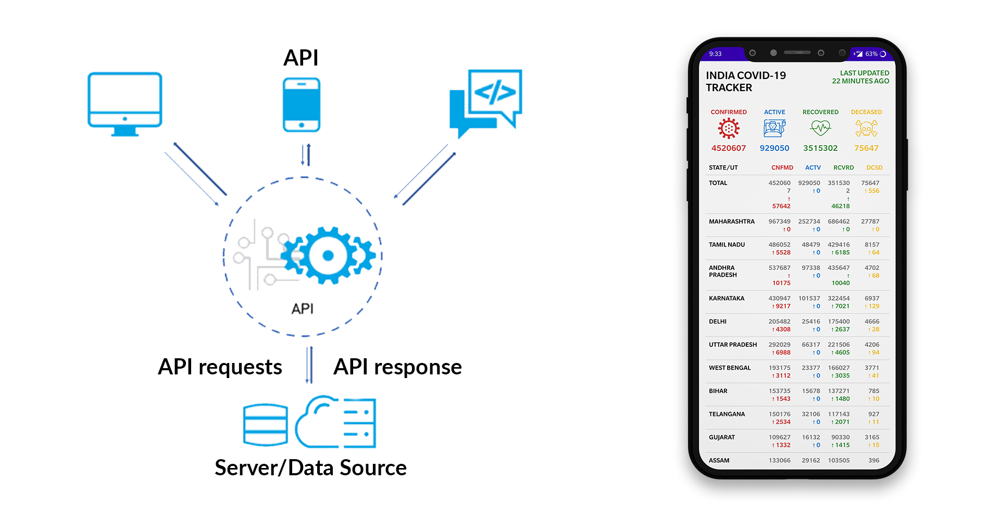

# CovidTracker

Covid india tracker app provides you the realtime data by fetching data from people which are a group of dedicated volunteers who curate and verify the data coming from several sources. They extract the details, like a patient's relationship with other patients to identify local and community transmissions, travel history and status. They never collect or expose any personally identifiable data regarding the patients. Data is fetched from www.covid19india.org.

